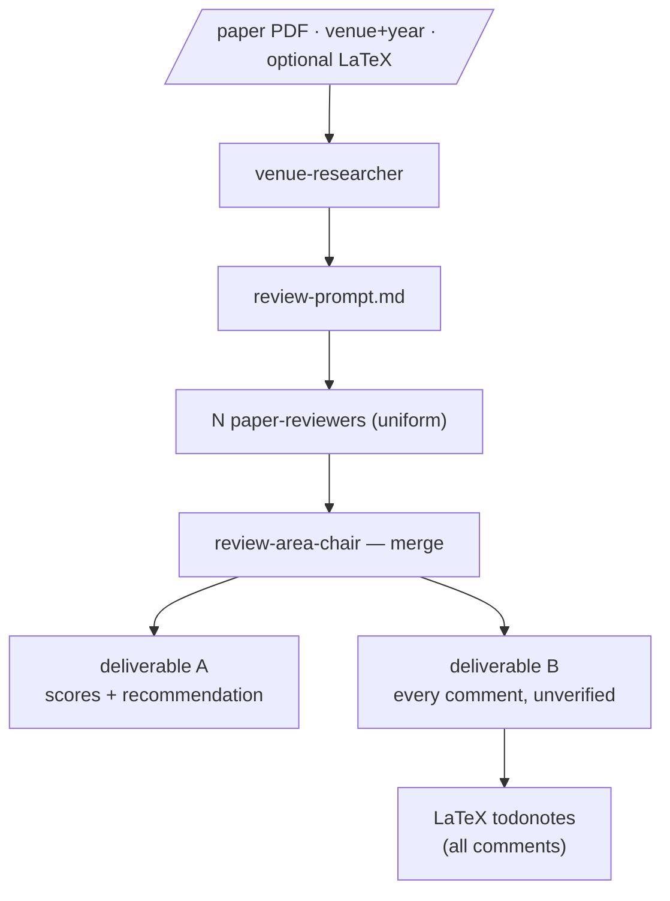
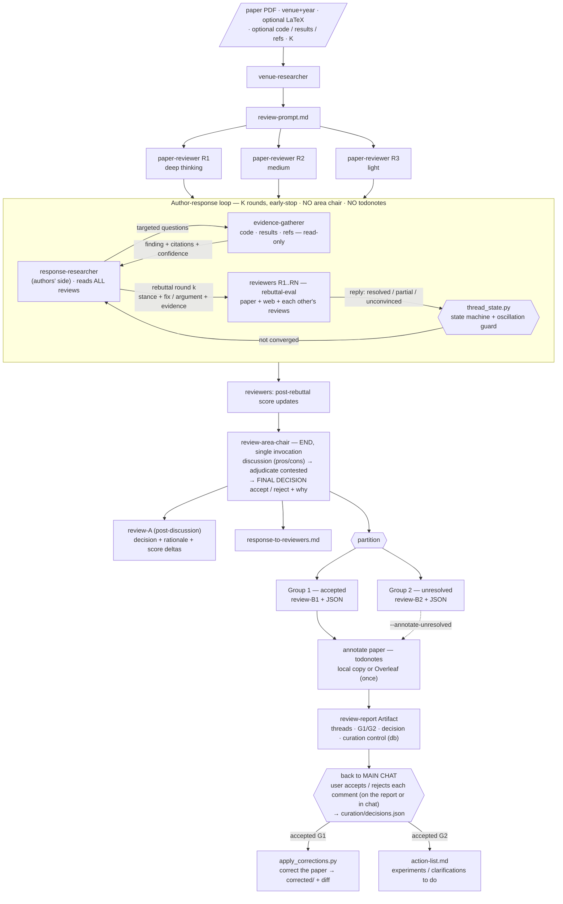
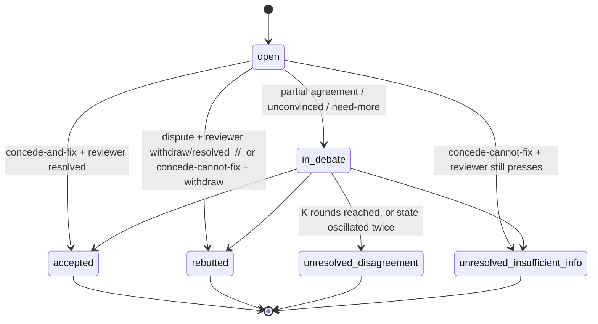

# paper-review — system diagram

How the `paper-review` skill is wired, in both modes. The same three diagrams are
published as an interactive Artifact (Panels A and B side by side); this file is
the source of record.

- **`static` mode** (Panel A) — one review pass: reviewer panel →
  `review-area-chair` merge → deliverables A + B → `todonotes`.
- **`loop` mode** (Panel B) — adds the author-response loop, the end-of-loop
  area-chair decision, the Group 1 / Group 2 split, a human curation gate, and
  then real paper corrections + an action list. No pre-loop merge; reviews stay
  per-reviewer; the area chair is invoked once, at the end.

Both modes also publish a per-run **review-report Artifact** (from
`skills/paper-review/assets/review-report-template.html`) — a browsable dashboard
of reviewers and comments; in loop mode it carries the rebuttal threads, the
decision, and a live per-comment Accept / Reject curation control backed by the
artifact `db`.

---

## Panel A — `static` mode (single pass)



Nothing tests whether a comment is right, fixable, or already answerable — every
comment lands in deliverable B and every one gets a `\todo`.

---

## Panel B — `loop` mode



---

## Panel C1 — comment lifecycle (state machine)



Group 1 = `accepted`. Group 2 = `unresolved_disagreement` ∪
`unresolved_insufficient_info`. `rebutted` is recorded in the discussion log only.

---

## Panel C2 — one loop round (sequence; area chair absent until the end)

```mermaid
sequenceDiagram
  participant SK as skill (orchestrator)
  participant RS as response-researcher
  participant EV as evidence-gatherer
  participant RV as reviewers R1..RN
  participant ST as thread_state.py

  Note over SK,ST: input = all N raw reviews, comments R&lt;i&gt;-&lt;nn&gt;, state = open
  loop each round k = 1..K  (SK stops early when a round changes nothing)
    RS->>EV: per-comment questions (code / results / refs)
    EV-->>RS: finding + supports(yes/no/partial/cannot-tell) + citations + confidence
    RS->>RV: rebuttal round k — one doc, per comment: stance + fix-or-argument + evidence
    Note over RV: each reviewer also sees the other reviews and replies
    RV-->>RS: reply per own comment — resolved / partial / unconvinced / need-more (+ severity change)
    RS->>ST: round-k stances + reviewer replies
    ST-->>SK: {changed, terminal, remaining} + oscillation flags
  end
  RV->>SK: post-rebuttal score updates (original -> revised)
```

The area chair, the curation gate, and the apply step happen after this loop —
see Panel B.
