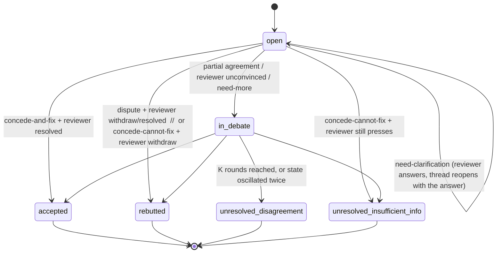

# Comment resolution states (loop mode)

The lifecycle every review comment goes through in `--mode loop` of the
`paper-review` skill, and how the final states map to the two output groups.
Referenced by `prompts/rebuttal-protocol.md`, `agents/review-area-chair.md`, and
`scripts/thread_state.py`.

`last_reviewed: 2026-09-06`

---

## States

| State | Meaning | Terminal? |
|---|---|---|
| `open` | Not yet addressed this round, or reopened after `need-clarification`. | no |
| `in_debate` | Addressed, but researcher and reviewer have not converged. | no |
| `accepted` | Researcher and the raising reviewer agree on a concrete correction that can be made now. | yes |
| `rebutted` | Either the reviewer withdrew after the rebuttal, or both sides agree the comment is valid but cannot be acted on and the reviewer does not press it. Recorded, not fixed, not in either group. | yes |
| `unresolved_disagreement` | After the loop, the parties still substantively disagree. | yes |
| `unresolved_insufficient_info` | The comment is (or may be) valid, but no available information can settle or address it — it needs new experiments, data, or author knowledge not present in the run. | yes |

## Transitions

The per-round stance × reply → state table is in `prompts/rebuttal-protocol.md`.

## Forced resolution at `k == K`

Any comment still `open` / `in_debate` when the loop ends is forced terminal:

- → `unresolved_insufficient_info` if the researcher's last stance was
  `concede-cannot-fix` or `need-clarification` (the blocker is missing
  information, not a genuine disagreement);
- → `unresolved_disagreement` otherwise.

## Oscillation guard

If a thread's state reverses direction twice
(`open → in_debate → open → in_debate`, or an `accepted`/`rebutted` that a later
round would undo), `thread_state.py` forces it to `unresolved_disagreement`,
sets `oscillated: true`, and stops updating it.

## Mapping to output groups (done by the area chair)

| Final state | Group | `group_reason` |
|---|---|---|
| `accepted` | **Group 1** | `agreed` |
| `unresolved_disagreement` | **Group 2** | `disagreement` |
| `unresolved_insufficient_info` | **Group 2** | `insufficient-info` |
| `rebutted` | — (neither) | recorded in `discussion-log.md` only |

- **Group 1 → `review-B1`** — carries the agreed `final_fix` text; feeds the
  annotation pass and, after the user's curation, `apply_corrections.py`.
- **Group 2 → `review-B2`** — carries the thread summary and "what would settle
  it"; after curation, accepted items become `action-list.md` entries.

The area chair groups near-duplicate comments across reviewers into one curation
row (keeping every `raised_by` id) so the user does not decide the same issue
twice.
